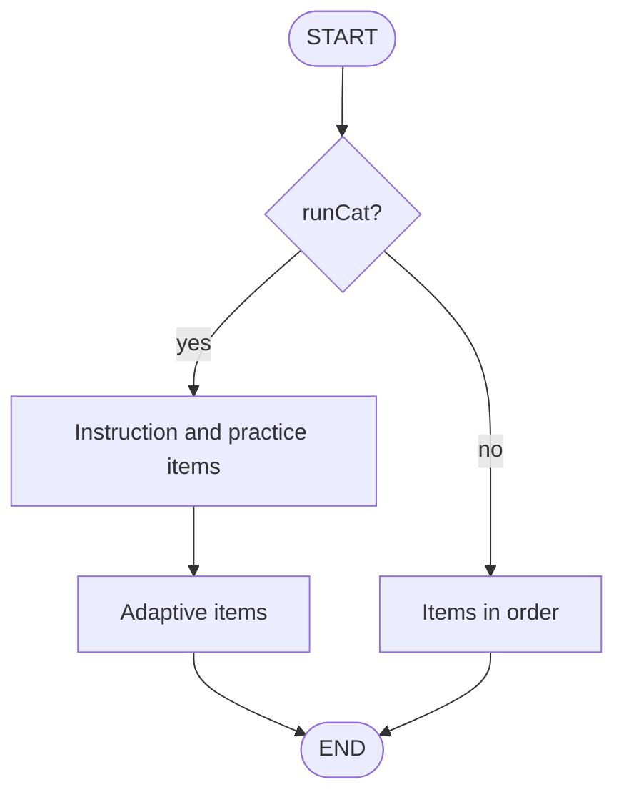

# Adult Reasoning (`adultReasoning`)

Timeline source: `src/tasks/adult-reasoning/`. See the [README](README.md) for the legend and shared conventions.

```mermaid
flowchart TD
    START([START]) --> CAT{runCat?}
    CAT -- yes --> P[Instruction and practice items] --> C[Adaptive items]
    CAT -- no --> NC[Items in order]
    C --> END([END])
    NC --> END
```
