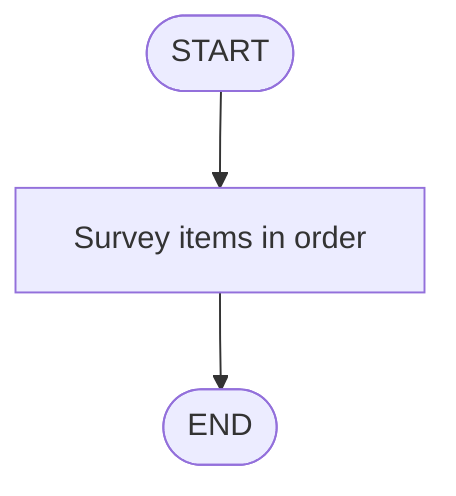

# Child Survey (`childSurvey`)

Timeline source: `src/tasks/child-survey/`. See the [README](README.md) for the legend and shared conventions.

```mermaid
flowchart TD
    START([START]) --> LOOP[Survey items in order]
    LOOP --> END([END])
```
