# Hearts and Flowers (`heartsAndFlowers`)

Timeline source: `src/tasks/hearts-and-flowers/`. See the [README](README.md) for the legend and shared conventions.

```mermaid
flowchart TD
    START([START]) --> IN[Input instructions] --> LB[Left button demo] --> RB[Right button demo]
    RB --> HB

    subgraph HEARTS["Hearts (press SAME side)"]
        HB[Intro screen] --> HIP1["Instruction practice 1"]
        HIP1 --> HC1{Correct?}
        HC1 -- no: try again --> HIP1
        HC1 -- yes --> HIP2["Instruction practice 2"]
        HIP2 --> HC2{Correct?}
        HC2 -- no: try again --> HIP2
        HC2 -- yes --> HTTP[Practice-time screen]
        HTTP --> HPR["Practice trials: fixation → stimulus → feedback"]
        HPR --> HS{"correctPracticeTrial<br/>correct in a row?"}
        HS -- yes: end practice early --> HPOST
        HS -- no, trials left --> HPR
        HS -- no, trials done --> HPOST[Transition screens]
        HPOST --> HT["Test trials: fixation → stimulus<br/>(timed)"]
    end

    HT --> FB

    subgraph FLOWERS["Flowers (press OPPOSITE side)"]
        FB[Intro screen] --> FIP["Instruction practice 1, then 2<br/>each repeats until correct"]
        FIP --> FTTP[Practice-time screen] --> FPR["Practice with feedback<br/>early exit on streak"]
        FPR --> FPOST[Transition screens]
        FPOST --> FT["Test trials"]
    end

    FT --> MB

    subgraph MIXED["Mixed (heart → same, flower → opposite)"]
        MB[Intro screen] --> MIP["Instruction practice: heart, then flower<br/>each repeats until correct"]
        MIP --> MTTP[Practice-time screen] --> MPR["Mixed practice with feedback<br/>early exit on streak"]
        MPR --> MPOST[Transition screens]
        MPOST --> MT["Mixed test trials"]
    end

    MT --> HEAVY{heavyInstructions?}
    HEAVY -- yes --> ENDG

    subgraph FASTER["Faster mixed blocks"]
        GF["Going-faster screen → mixed test trials<br/>with a shorter time limit<br/>(repeated for each faster block)"]
    end

    HEAVY -- no --> GF
    GF --> ENDG[End screen] --> EXIT([Exit fullscreen])
```

**Trial timing.** Fixation lasts the inter-stimulus interval. A test stimulus stays up for a limited time; with no response, the trial is recorded as timed out and incorrect, and the task moves on. Practice and instruction-practice trials have no time limit and wait for a response.
