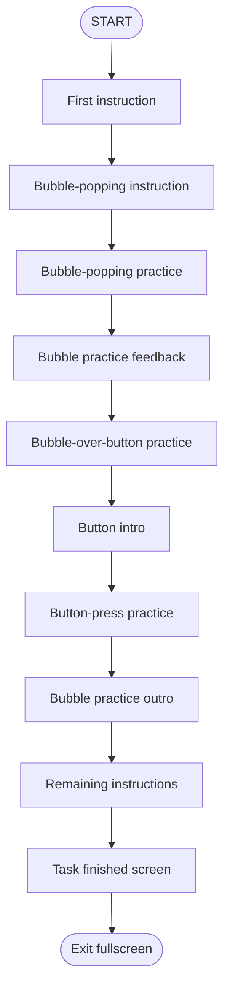

# Intro (`intro`)

Timeline source: `src/tasks/intro/`. See the [README](README.md) for the legend and shared conventions.

```mermaid
flowchart TD
    START([START]) --> I1[First instruction]
    I1 --> BI[Bubble-popping instruction] --> BP[Bubble-popping practice]
    BP --> BFI[Bubble practice feedback] --> BOB[Bubble-over-button practice]
    BOB --> BTI[Button intro] --> BTP[Button-press practice]
    BTP --> OUT[Bubble practice outro] --> REM[Remaining instructions]
    REM --> FIN[Task finished screen] --> EXIT([Exit fullscreen])
```
