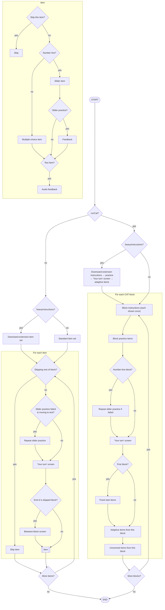

# Math (`egmaMath`)

Timeline source: `src/tasks/math/`. See the [README](README.md) for the legend and shared conventions.

```mermaid
flowchart TD
    START([START]) --> CAT{runCat?}

    CAT -- no --> HI{heavyInstructions?}
    HI -- yes --> USE_D[Downward-extension item set]
    HI -- no --> USE_S[Standard item set]
    USE_D --> LOOP
    USE_S --> LOOP

    subgraph NONCAT["For each item"]
        LOOP{"Skipping rest of block?"}
        LOOP -- yes --> SKIP[Skip item]
        LOOP -- no --> RSP{"Slider practice failed<br/>& moving to test?"}
        RSP -- yes --> REP[Repeat slider practice] --> PT
        RSP -- no --> PT["'Your turn' screen"]
        PT --> GAP{"End of a skipped block?"}
        GAP -- yes --> IBG[Between-block screen] --> SB
        GAP -- no --> SB
    end

    SB[[Item]]
    SKIP --> NEXT
    SB --> NEXT{More items?}
    NEXT -- yes --> LOOP
    NEXT -- no --> END([END])

    CAT -- yes --> HI2{heavyInstructions?}
    HI2 -- yes --> DX["Downward-extension instructions → practice<br/>→ 'Your turn' screen → adaptive items"]
    DX --> BLK
    HI2 -- no --> BLK

    subgraph CATBLOCKS["For each CAT block"]
        BLK["Block instructions (each shown once)"] --> BP[Block practice items]
        BP --> SL{Number-line block?}
        SL -- yes --> RSP2[Repeat slider practice if failed] --> BPT
        SL -- no --> BPT["'Your turn' screen"]
        BPT --> ST{First block?}
        ST -- yes --> SI[Fixed start items] --> CT
        ST -- no --> CT[Adaptive items from this block]
        CT --> UN[Unnormed items from this block]
    end

    UN --> MORE{More blocks?}
    MORE -- yes --> BLK
    MORE -- no --> END

    subgraph STIM["Item"]
        direction TB
        S0{Skip this item?}
        S0 -- yes --> S_SKIP[Skip]
        S0 -- no --> S1{Number line?}
        S1 -- no --> AFC[Multiple-choice item]
        S1 -- yes --> SLD[Slider item] --> SFB{Slider practice?}
        SFB -- yes --> FB[Feedback]
        AFC --> AR{Test item?}
        SFB -- no --> AR
        FB --> AR
        AR -- yes --> AUD[Audio feedback]
    end
```
