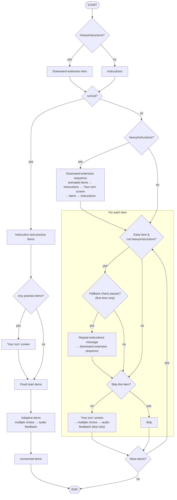

# Matrix Reasoning (`matrixReasoning`)

Timeline source: `src/tasks/matrix-reasoning/`. See the [README](README.md) for the legend and shared conventions.

```mermaid
flowchart TD
    START([START]) --> INS{heavyInstructions?}
    INS -- yes --> DI[Downward-extension intro]
    INS -- no --> STDI[Instructions]
    DI --> CAT{runCat?}
    STDI --> CAT

    CAT -- yes --> C_IP[Instruction and practice items]
    C_IP --> C_PT{Any practice items?}
    C_PT -- yes --> C_PTR["'Your turn' screen"] --> C_START
    C_PT -- no --> C_START[Fixed start items]
    C_START --> C_LOOP["Adaptive items<br/>multiple choice → audio feedback"]
    C_LOOP --> C_UN[Unnormed items]
    C_UN --> END([END])

    CAT -- no --> HV{heavyInstructions?}
    HV -- yes --> DXS["Downward-extension sequence<br/>animated items → instructions → 'Your turn' screen<br/>→ items → instructions"]
    DXS --> MAIN
    HV -- no --> MAIN

    subgraph MAINLOOP["For each item"]
        MAIN{"Early item &<br/>not heavyInstructions?"}
        MAIN -- yes --> FBK{"Fallback check passes?<br/>(first time only)"}
        FBK -- yes --> FALL["Repeat-instructions message<br/>→ downward-extension sequence"] --> SB
        FBK -- no --> SB
        MAIN -- no --> SB
        SB{Skip this item?}
        SB -- yes --> SKIP[Skip]
        SB -- no --> TRIAL["'Your turn' screen<br/>→ multiple choice → audio feedback (test only)"]
    end

    TRIAL --> NEXT{More items?}
    SKIP --> NEXT
    NEXT -- yes --> MAIN
    NEXT -- no --> END
```
