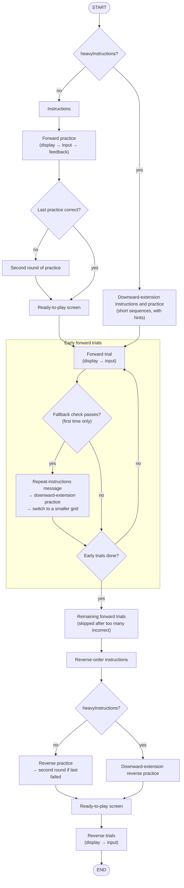

# Memory Game (`memoryGame`, Corsi blocks)

Timeline source: `src/tasks/memory-game/`. See the [README](README.md) for the legend and shared conventions.

```mermaid
flowchart TD
    START([START]) --> HV{heavyInstructions?}

    HV -- no --> DEF_I[Instructions]
    DEF_I --> DEF_P["Forward practice<br/>(display → input → feedback)"]
    DEF_P --> DEF_C{Last practice correct?}
    DEF_C -- no --> DEF_P2[Second round of practice] --> RTP1
    DEF_C -- yes --> RTP1[Ready-to-play screen]

    HV -- yes --> DX["Downward-extension instructions and practice<br/>(short sequences, with hints)"]

    RTP1 --> F4
    DX --> F4

    subgraph EARLY["Early forward trials"]
        F4["Forward trial<br/>(display → input)"] --> FBC{"Fallback check passes?<br/>(first time only)"}
        FBC -- yes --> FALL["Repeat-instructions message<br/>→ downward-extension practice<br/>→ switch to a smaller grid"] --> F4N
        FBC -- no --> F4N{Early trials done?}
        F4N -- no --> F4
    end

    F4N -- yes --> FWD["Remaining forward trials<br/>(skipped after too many incorrect)"]
    FWD --> REV_I[Reverse-order instructions]
    REV_I --> HV2{heavyInstructions?}
    HV2 -- no --> RP["Reverse practice<br/>→ second round if last failed"]
    HV2 -- yes --> RDX[Downward-extension reverse practice]
    RP --> RTP2[Ready-to-play screen]
    RDX --> RTP2
    RTP2 --> REV["Reverse trials<br/>(display → input)"]
    REV --> END([END])
```
