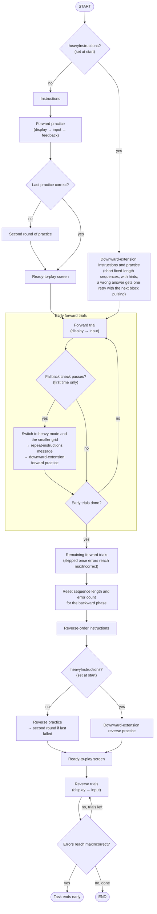
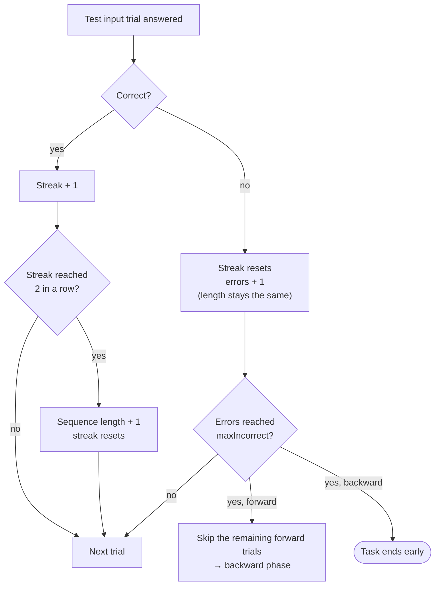

# Memory Game (`memoryGame`, Corsi blocks)

Timeline source: `src/tasks/memory-game/`. See the [README](README.md) for the legend and shared conventions.

Each **trial** is a pair: a display trial (blocks light up in a random sequence), then an input trial (the child taps them back, in reverse order for backward trials). The sequence is generated when the display trial starts. Nothing about the sequence comes from a corpus.

## Set when the task starts

Two settings are fixed before the first screen. Both depend on the child's age (the `age` param, or the age from the birth month and year):

| Setting | Rule | Effect |
|---|---|---|
| **Instruction flow** | Heavy if the `heavyInstructions` variant param is on, **or** age ≤ 4 | Heavy: downward-extension instructions and practice, with short fixed-length sequences and hints. Otherwise: the default instructions and practice. |
| **Grid** | 3×3 (9 blocks) if age > 4, otherwise 2×2 (4 larger blocks) | Board size for the whole task, unless the fallback switches it |

That gives these starting combinations:

| | Grid | Instruction flow |
|---|---|---|
| age > 4 | 3×3 | default |
| age > 4, `heavyInstructions` on | 3×3 | heavy |
| age ≤ 4 | 2×2 | heavy (always) |
| age unknown | 2×2 | default, unless `heavyInstructions` is on |

The last row is a side effect: an unknown age is `NaN`, which is neither ≤ 4 nor > 4.

"Downex" (downward extension) is the same thing as the heavy flow: an easier version of the instructions and practice for younger children.

## Flow

Every forward trial, early or not, is skipped once errors reach `maxIncorrect` (see below). The two `heavyInstructions?` diamonds are decided when the timeline is built. The fallback changes some settings while the task runs, but it does not change which backward practice is used.

## How difficulty adapts

Difficulty is the **sequence length** (how many blocks light up). It follows a simple staircase that **only goes up**, and it only changes on test trials. Practice trials never change the length or the error count.

- **Starting length:** 2 for forward. For backward: 3 if the child got past length 3 going forward, otherwise 2.
- **Errors are a running total, not consecutive.** A correct answer resets the streak but not the error count. The error count resets once, before the backward phase.
- **`maxIncorrect`** is a variant param (default 3).
- **Fixed-length practice:** heavy practice uses fixed lengths instead of the staircase, and leaves the staircase untouched.

These rules live in the input trial's `on_finish` in `trials/stimulus.ts`.

## Fallback (switching to the heavy flow mid-task)

After each of the early forward test trials, a check runs. It can pass at most once, and passes when **the last 2 forward answers were both wrong**. (`checkFallbackCriteria` reads the last 4 test-stage records, which are 2 display/input pairs, and counts wrong inputs.) If it passes:

1. `heavyInstructions` turns on, and the grid switches to 2×2 with larger blocks for the rest of the task.
2. The repeat-instructions message plays, then the downward-extension forward practice.
3. The forward test trials continue on the smaller grid.

The fallback does **not** reset the error count or the sequence length. Backward practice stays the one chosen at the start, but display prompts for the rest of the task use the heavy versions, because they check `heavyInstructions` as each trial runs.

## Not CAT

Memory game does not use computerized adaptive testing:

- **CAT** (in tasks like math, matrix reasoning and vocab) keeps an ability estimate (theta) from an IRT model. It updates the estimate after each answer and picks the next corpus item by its calibrated difficulty, stopping once the estimate is precise enough.
- **Memory game** has no item difficulties, no ability estimate and no item selection. Sequences are random, the length follows the staircase above, and it stops on a fixed number of errors. The `cat` / `runCat` param has no effect on it.

The timeline does call `initializeCat()`, but nothing in memory game reads or updates the result.
