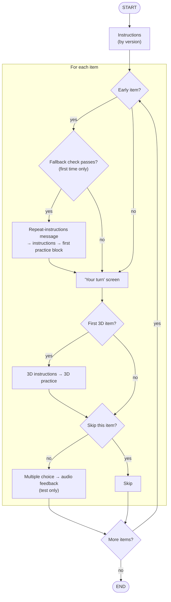
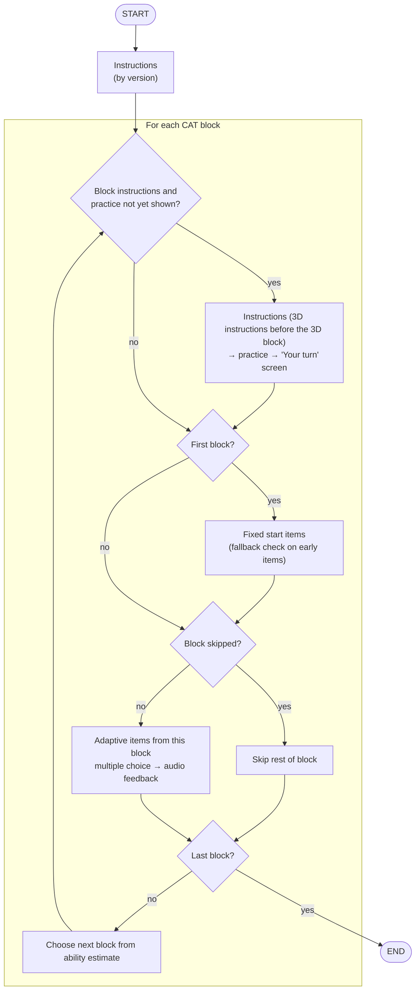

# Mental Rotation (`mentalRotation`)

Timeline source: `src/tasks/mental-rotation/`. See the [README](README.md) for the legend and shared conventions.

## Non-CAT

```mermaid
flowchart TD
    START([START]) --> INS["Instructions<br/>(by version)"]
    INS --> LOOP

    subgraph PER["For each item"]
        LOOP{Early item?}
        LOOP -- yes --> FB{"Fallback check passes?<br/>(first time only)"}
        FB -- yes --> FALL["Repeat-instructions message<br/>→ instructions → first practice block"] --> SET
        FB -- no --> SET
        LOOP -- no --> SET
        SET["'Your turn' screen"] --> TD{First 3D item?}
        TD -- yes --> TDI[3D instructions → 3D practice] --> SB
        TD -- no --> SB{Skip this item?}
        SB -- yes --> SKIP[Skip]
        SB -- no --> AFC["Multiple choice → audio feedback<br/>(test only)"]
    end

    AFC --> NEXT{More items?}
    SKIP --> NEXT
    NEXT -- yes --> LOOP
    NEXT -- no --> END([END])
```

## CAT

```mermaid
flowchart TD
    START([START]) --> INS["Instructions<br/>(by version)"]
    INS --> BLK

    subgraph EACH["For each CAT block"]
        BLK{"Block instructions and<br/>practice not yet shown?"}
        BLK -- yes --> IP["Instructions (3D instructions before the 3D block)<br/>→ practice → 'Your turn' screen"] --> FIRST
        BLK -- no --> FIRST{First block?}
        FIRST -- yes --> STARTI["Fixed start items<br/>(fallback check on early items)"] --> CT
        FIRST -- no --> CT{Block skipped?}
        CT -- yes --> SKIPB[Skip rest of block] --> LAST
        CT -- no --> TRIAL["Adaptive items from this block<br/>multiple choice → audio feedback"] --> LAST{Last block?}
        LAST -- no --> NB[Choose next block from ability estimate]
    end

    NB --> BLK
    LAST -- yes --> END([END])
```
