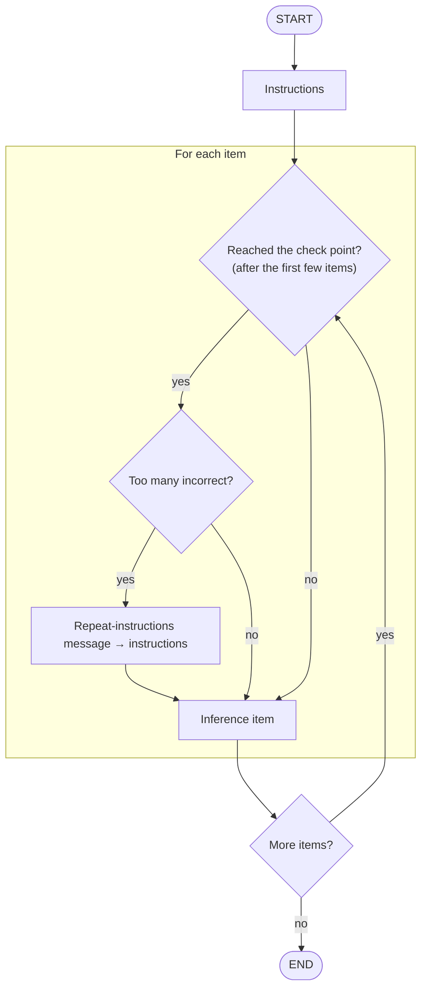

# ROAR Inference (`roarInference`)

Timeline source: `src/tasks/roar-inference/`. See the [README](README.md) for the legend and shared conventions.

```mermaid
flowchart TD
    START([START]) --> INS[Instructions]
    INS --> LOOP

    subgraph PER["For each item"]
        LOOP{"Reached the check point?<br/>(after the first few items)"}
        LOOP -- yes --> RI{Too many incorrect?}
        RI -- yes --> REP[Repeat-instructions message → instructions] --> AFC
        RI -- no --> AFC
        LOOP -- no --> AFC[Inference item]
    end

    AFC --> NEXT{More items?}
    NEXT -- yes --> LOOP
    NEXT -- no --> END([END])
```
