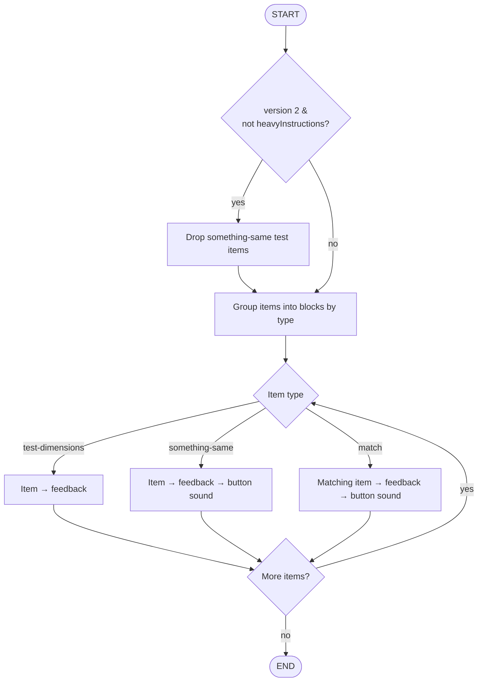
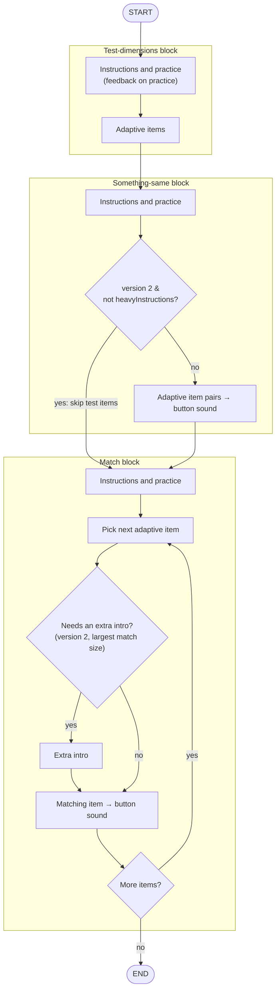

# Same-Different Selection (`sameDifferentSelection`)

Timeline source: `src/tasks/same-different-selection/`. See the [README](README.md) for the legend and shared conventions.

## Non-CAT

Feedback and the button sound run only for some item types and stages.

## CAT

