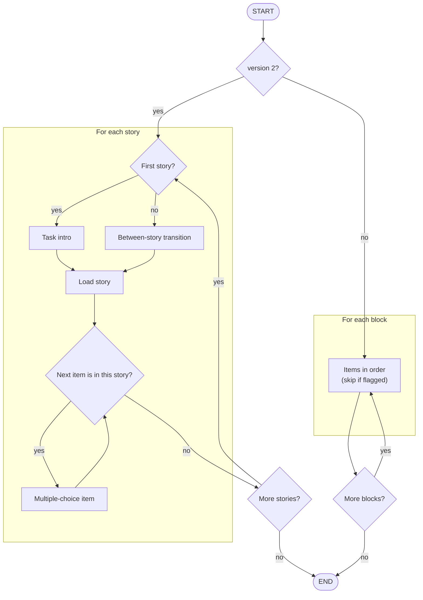

# Theory of Mind (`theoryOfMind`), also used by `hostileAttribution`

Timeline source: `src/tasks/theory-of-mind/`. See the [README](README.md) for the legend and shared conventions.

```mermaid
flowchart TD
    START([START]) --> V{version 2?}

    V -- yes --> STORY

    subgraph V2["For each story"]
        STORY{First story?}
        STORY -- yes --> INTRO[Task intro] --> SG
        STORY -- no --> TRANS[Between-story transition] --> SG
        SG[Load story] --> ST{Next item is in this story?}
        ST -- yes --> AFC1[Multiple-choice item] --> ST
    end

    ST -- no --> MORE{More stories?}
    MORE -- yes --> STORY
    MORE -- no --> END([END])

    V -- no --> BL

    subgraph V1["For each block"]
        BL["Items in order<br/>(skip if flagged)"]
    end

    BL --> MOREB{More blocks?}
    MOREB -- yes --> BL
    MOREB -- no --> END
```
