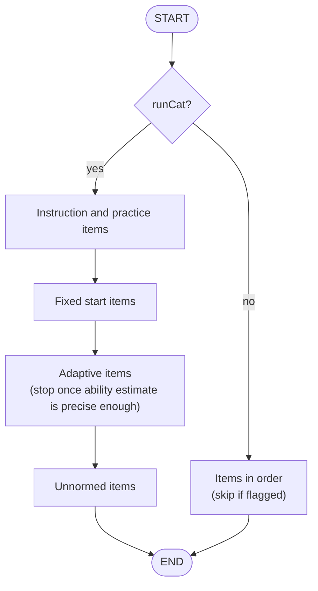

# Vocab (`vocab`)

Timeline source: `src/tasks/vocab/`. See the [README](README.md) for the legend and shared conventions.

```mermaid
flowchart TD
    START([START]) --> CAT{runCat?}

    CAT -- yes --> IP[Instruction and practice items]
    IP --> SI[Fixed start items]
    SI --> CL["Adaptive items<br/>(stop once ability estimate is precise enough)"]
    CL --> UN[Unnormed items]
    UN --> END([END])

    CAT -- no --> LOOP["Items in order<br/>(skip if flagged)"]
    LOOP --> END
```
